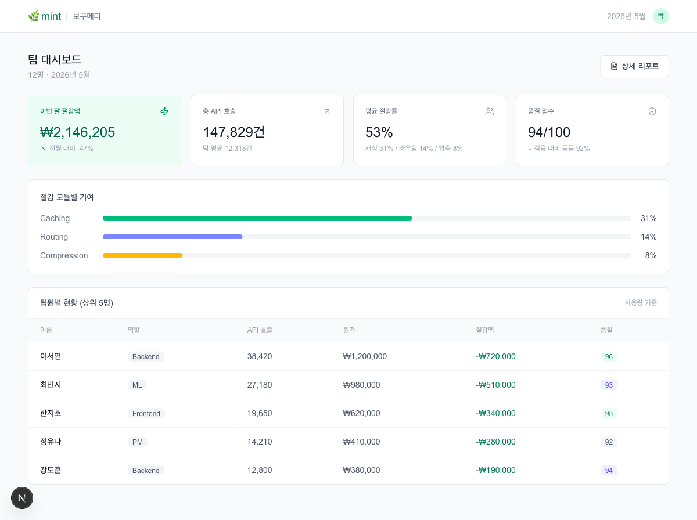
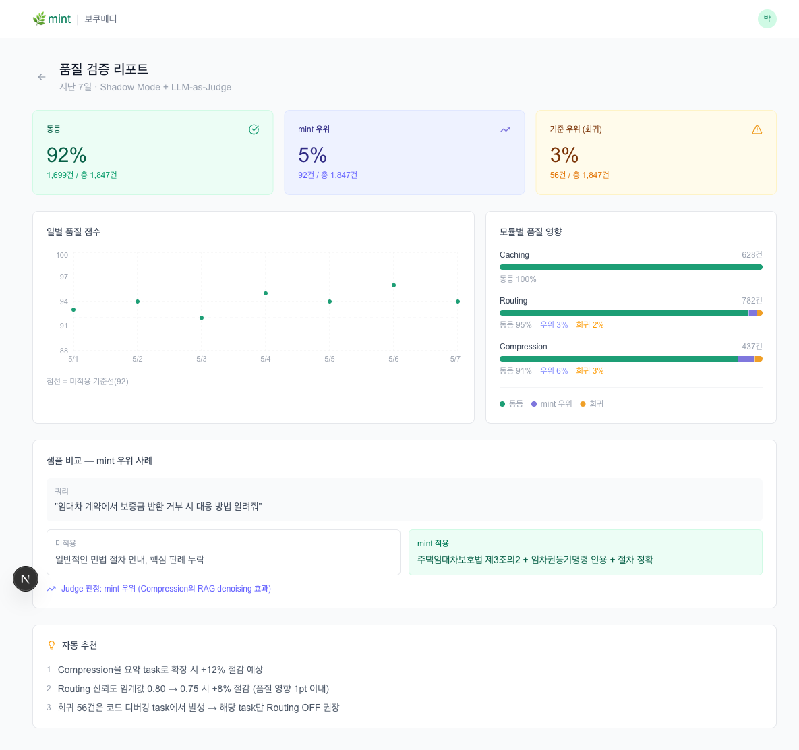

# minT — 품질 검증형 LLM API 비용 최적화 프록시

**한국어 형태소 정규화와 복잡도 기반의 라우팅을 이용한 품질 검증형 LLM API 비용 최적화 프록시**


## 한 줄 요약

LLM API 앞에 두는 투명 프록시. **Base URL 한 줄만 바꾸면** 캐싱·한국어 정규화·복잡도 라우팅
세 엔진으로 비용을 줄이고, 줄인 뒤에도 응답 품질이 유지되는지를 **자동으로 검증**합니다.

## 결과

| 지표 | 값 |
|---|---|
| 입력 토큰 절감 | 약 22% |
| 프롬프트 캐시 적중률 | 41% → **67%** |
| 통합 비용 절감률 | 약 **62%** |
| 품질 동등 이상 비율 (LLM-as-a-Judge) | 약 **97%** |

모듈별 비용 절감: 캐싱만 30% → 한국어 정규화 추가 45% → 복잡도 라우팅까지 62%.

품질 판정 내역: 동등 92%, minT 우위 5%, 기준 우위 3%.

| 월간 비용 대시보드 | 주간 품질 리포트 |
|---|---|
|  |  |

---

## 무엇이 새로운가

기존 상용 LLM 게이트웨이(OpenRouter, Portkey, Helicone, LiteLLM 등)에는 두 가지 공백이
있었습니다.

1. **품질 검증이 없다.** 비용 절감과 트래픽 라우팅은 제공하지만, 비용을 줄인 뒤 응답
   품질이 유지되었는지는 사용자가 따로 확인해야 합니다
2. **한국어 특수성이 반영되지 않았다.** 토크나이저가 비영어권 언어를 비효율적으로 표현해
   한국어는 같은 의미를 영어보다 많은 토큰으로 인코딩합니다 (Yang et al. 2024,
   Petrov et al. 2023)

### 핵심 기여: 정규화를 캐시 키 함수로 재해석

한국어는 교착어라서 같은 의미의 질의가 조사·어미 변이로 여러 표면형으로 나타납니다.

> "결제 버그를 고쳐줘" / "결제 버그 좀 고쳐주세요" / "결제 버그 고쳐 줄래?"

의미는 같지만 문자열이 다릅니다. 원문을 그대로 해시하면 정확 일치(exact-match) 캐시는
이들을 서로 다른 키로 취급해 **모두 캐시 미스**를 발생시킵니다. 이것이 한국어 질의에서
캐시 적중률이 구조적으로 낮아지는 원인입니다.

형태소 정규화 함수 `N(·)`을 **두 역할을 동시에 하는 것**으로 봅니다.

- **토큰 절감**: 입력 토큰 수를 직접 감소 (식 1: `ρ_tok = 1 − |N(p)|/|p|`)
- **캐시 키 정규화**: 표면형 변이를 표준형으로 수렴시켜 같은 캐시 키를 공유 (식 2)

정규화 모듈과 캐싱 모듈 사이에 **시너지**가 생기고, 이것이 캐시 적중률을 41%에서 67%로
끌어올린 부분입니다. 한국어 인지형 정규화기가 없는 기존 게이트웨이는 원문 정규화 일치
캐싱만 수행하므로 이 시너지를 활용하지 못합니다.

---

## 구조

```
사용자 질의
  │
  ├─ ① 한국어 형태소 정규화 → 표준형 질의 (식 1)
  │     · 보수적 정규화(default, lossless): 조사·어미 차환, 공백·중복 종결어미 정리
  │     · 공격적 압축(opt-in, lossy 가능): LLMLingua류 토큰 압축
  │
  ├─ ② 표준형 해시 키 생성 (SHA-256, 식 2)
  │     └─ 캐시 적중 → 즉시 반환 (≈0ms, 비용 0)
  │
  ├─ ③ 캐시 미스 → 복잡도 점수 s(p̂) 계산 (식 3, 시그모이드)
  │     특징: 토큰 길이, 코드 블록 비율, 추론 키워드 빈도, 문장 구조 깊이
  │
  ├─ ④ 복잡도 기반 캐스케이드 라우팅 (식 4, 임계값 τ₁ < τ₂)
  │     단순 → 저가 모델 · 중간 → 중간 모델 · 복잡 → 고비용 모델
  │     불확실 시 강한 모델로 fallback
  │
  └─ ⑤ Shadow Mode 품질 검증 (식 5)
        표본 비율에 대해 기준 응답을 병행 생성 → LLM-as-a-Judge 비교
        → 동등 이상 비율 Q, 비용 절감률 R (식 6) 산출
```

### 라우팅 계층

| 계층 | 분류기 | 모델 | 단가 | 복잡도 |
|---|---|---|---|---|
| L1 | 휴리스틱 (분기 결정) | — | ~0ms·free | — |
| L2 | 로컬 SLM | Local SLM | ~free | 경계 |
| L3 | 저가 API | Flash/Haiku | 매우 낮음 | 단순 |
| L4 | Catch-all | 중간 모델 | 낮음 | 중간 |
| — | 직접 배정 | Sonnet/Opus | 높음 | 복잡 |

학습 기반 라우터(RouteLLM)와 같은 캐스케이드 패러다임을 따르되, **학습 라우터 앞에
영지연(zero-latency) 휴리스틱 계층을 두어** 단순 질의를 즉시 분기시키는 점이 다릅니다.

### 안전장치 네 가지

1. 도입 초기 2주 Shadow Mode 보정(calibration)
2. 약한 모델의 불확실성 신호 시 강한 모델로 자동 재시도(fallback)
3. 품질 점수가 임계치 미만이면 자동 비활성화(rollback)
4. 코드·법률·의료 등 고위험 도메인은 기본 OFF

라우팅은 opt-in이며, **기본 경로에는 손실 없는 캐싱과 보수적 정규화만 동작**합니다.

---

## 실험 설정

한국어·영어 혼합 개발 질의를 난이도 3단계로 구성했습니다.

- **단순** — 함수 설명, 단순 질문, 번역
- **중간** — 버그 수정, 리팩토링, API 구현
- **복잡** — 아키텍처 설계, 분산 시스템

비교 기준(baseline)은 모든 질의를 단일 고비용 모델로 처리하는 경우입니다.
Shadow Mode가 '미적용 시 비용'도 동시에 측정하므로 비용 절감률을 객관 산정할 수 있습니다.

---

## 한계 

- **데이터셋이 개발 질의에 편중**되어 일반 대화·문서 작업으로의 일반화 검증이 필요합니다
- **복잡도 가중치가 휴리스틱**입니다. 학습 기반 라우터와의 비교가 향후 과제입니다
- **공격적 압축의 의미 보존 한계**는 과업별 추가 정량화가 필요합니다

---

## 레포 구성

```
harness/    실험 하네스 — 데이터 수집 · 지표 측정 · LLM-as-a-Judge 채점
  data/       생성된 질의 데이터셋 (queries · clusters · klue_sts · stream)
  run/        라벨링 결과 (queries_full_labeled 500건, queries_labeled 30건)
cli/        minT CLI 데모 (pip 설치형) + 라우팅 시나리오용 샘플 프로젝트
dashboard/  비용·품질 대시보드 (Next.js) — 논문 그림 2·3의 화면
docs/       대시보드 스크린샷
```

| 구성 | 파일 | 역할 |
|---|---|---|
| `harness/mint_collect.py` | 156줄 | 질의 데이터셋 생성 (RealQA 500 · WildChat 5000 · KLUE-STS) |
| `harness/mint_harness.py` | 214줄 | 토큰 절감·캐시 적중·비용 절감 측정 |
| `harness/mint_judge.py` | 215줄 | LLM-as-a-Judge 라벨링 · 품질 비교 · Cohen's kappa |
| `cli/mint/routing.py` | — | 복잡도 점수·계층 배정 로직 |
| `cli/mint/scenarios.py` | — | 난이도별 시나리오 정의 |

## 실행

```bash
# 실험 하네스
cd harness
python mint_collect.py --out data --realqa 500 --wildchat 5000   # 데이터셋 생성
python mint_harness.py --dir run                                  # 지표 측정
python mint_judge.py --task label --in run/queries.jsonl           # 라벨링
python mint_judge.py --task quality                                # 품질 비교
python mint_judge.py --task kappa                                  # 평가자 일치도

# CLI 데모
cd cli && pip install -e . && mint

# 대시보드
cd dashboard && npm install && npm run dev
```

`mint_judge.py`는 `--mock`으로 API 호출 없이 돌릴 수 있고, `--estimate`로 호출 비용을
미리 추산합니다.

> **재현성에 대한 정직한 한계.** 이 코드는 프로토타입입니다.
> 패키지로 정리된 프로덕션 프록시가 아니고, 스크립트 인자 기본값이 당시 실험 디렉토리
> 구조에 맞춰져 있습니다. 수치는 이 하네스로 측정한 것이지만, 클론 직후 한 번에
> 전부 재현되도록 정리하는 작업은 아직 하지 않았습니다.
> LLM 응답 캐시(`.mint_llm_cache.json`)는 실행 산출물이라 제외했습니다.

---

## 참고문헌

1. CloudZero, "2025 State of AI Costs," Technical Report, 2025
2. Chen, Zaharia & Zou, "FrugalGPT," [arXiv:2305.05176](https://arxiv.org/abs/2305.05176), 2023
3. Ong et al., "RouteLLM: Learning to Route LLMs with Preference Data," [arXiv:2406.18665](https://arxiv.org/abs/2406.18665), 2024
4. Jiang et al., "LLMLingua," EMNLP, pp. 13358–13376, 2023
5. Yang, Wang, Lin & Zhao, "Problematic Tokens: Tokenizer Bias in Large Language Models," [arXiv:2406.11214](https://arxiv.org/abs/2406.11214), 2024
6. Petrov, La Malfa, Torr & Bibi, "Language Model Tokenizers Introduce Unfairness Between Languages," NeurIPS, 2023 ([arXiv:2305.15425](https://arxiv.org/abs/2305.15425))
7. Zheng et al., "Judging LLM-as-a-Judge with MT-Bench and Chatbot Arena," NeurIPS, 2023 ([arXiv:2306.05685](https://arxiv.org/abs/2306.05685))


